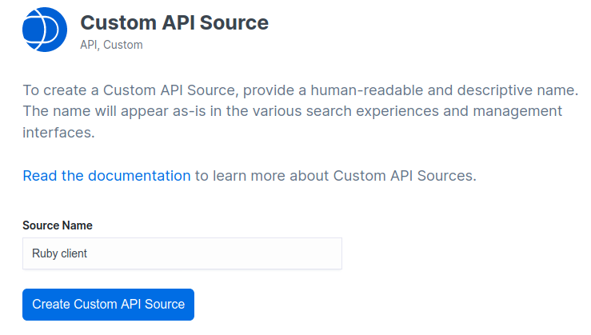
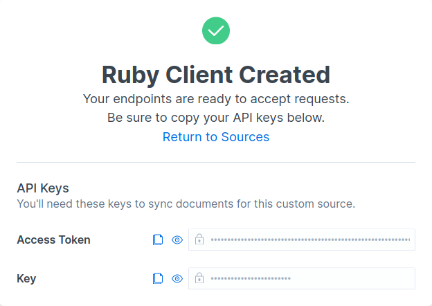

# elastic-enterprise-search

This gem is the official Elastic Enterprise Search client and it's [currently out as a beta release](https://rubygems.org/gems/elastic-enterprise-search/versions/7.10.0.beta.1). Enterprise Search is an Elastic solution for search in the enterprise. It's powered by the Elastic Stack and Elasticsearch, so you get all the great things you already know in one package for your team. It's the umbrella solution which contains Workplace Search, App Search and Site Search. The client focuses on App Search and Workplace Search.

## What is Elastic Workplace Search?

Workplace Search is a unified search solution for teams. One of the interesting things about Workplace Search to me is at previous jobs I wished I had a product like this. We had different documents and manuals on so many different services: wikis, Jira, email, Dropbox, Basecamp. Whenever you needed to find a specific document you had to find out where to look for it, and then search. Workplace gives you a single search experience across all your content. There are already built-in integrations for Google Drive, Sharepoint, GitHub and other popular services. But you can also add Custom Document Sources if you're using a system which doesn't have an integration yet and start indexing documents.

## What is Elastic App Search?

App Search is a ready to use search solution with built in analytics and user friendly relevance tuning. You can use it to add this search experience to an app, web, etc. In App Search you create engines, information repositories that specialize in search. It's really easy to index JSON documents and make them accessible from search right away, you don't need to specify a schema, since it's created automatically for you.

## The Enterprise Search gem

Based on our experience maintaining the Elasticsearch clients, one of the ideas we had during the development of this client was to reuse the Elasticsearch client's HTTP transport layer. These clients are pretty well tested and they've been designed in a modular way. So we opened a branch to include the dependency on [elasticsearch-transport](https://github.com/elastic/elasticsearch-ruby/tree/master/elasticsearch-transport#elasticsearchtransport), removed all the http connection code from the new clients and tried it out. It was rather easy, as you can see in the following code, it's optimized for use with Elasticsearch but it's an HTTP library:

```ruby
require 'elasticsearch-transport'

client = Elasticsearch::Transport::Client.new(
  host: 'http://jsonplaceholder.typicode.com:80'
)

client.perform_request('get', 'posts/42').body

  => {"userId"=>5, "id"=>42, "title"=>"commodi ullam sint et excepturi error explicabo praesentium voluptas", "body"=>"odio fugit voluptatum ducimus earum autem est incidunt voluptatem\nodit reiciendis aliquam su
nt sequi nulla dolorem\nnon facere repellendus voluptates quia\nratione harum vitae ut"}
```

The Enterprise Search client was built with the HTTP layer from the Elasticsearch client and the APIs from each service in Enterprise Search. The code for each of the APIs is generated from an OpenAPI JSON Spec which we've worked on together with the Enterprise Search, Workplace Search and App Search teams. So when the API for any of these changes in a new version, we just need to update the Open API spec and regenerate the code.

With these clients your app can integrate seamlessly with Elastic Enterprise Search. You can check out the code [on GitHub](https://github.com/elastic/enterprise-search-ruby/) or install from RubyGems:

```bash
$ gem install elastic-enterprise-search --pre
```

The source code includes a rake task for running the Enterprise Search stack via Docker: `rake stack[version]`, but you can also set up an instance in Elastic Cloud. Once you have an instance running, either via Docker or Cloud, you can try out the client:

```ruby
require 'elastic-enterprise-search'

# These are the default credentials if you're running the stack rake task:
http_auth = { user: 'elastic', password: 'changeme' }
host = 'localhost:3002'

client = Elastic::EnterpriseSearch::Client.new(log: true, host: host, http_auth: http_auth)
response = client.health
```

The response object is an instance of `Elasticsearch::Transport::Transport::Response` from `elasticsearch-transport`. You can call  `headers` or `status` on it, but you'll usually use `response.body` to see the JSON response from the server. The `EnterpriseSearch::Client` API gives you some useful endpoints to check the status of your cluster and managing read-only mode. You can read more [here](https://github.com/elastic/enterprise-search-ruby#enterprise-search).

For Workplace Search and App Search, you can instantiate a new client or share the transport layer with an Enterprise Search client you've already created. This means they'll share the same host, but both Workplace Search and App Search have their own authentication method.

## Using Workplace Search

To start using the client, we need to open our Enterprise Search web UI on our browser and select Workplace Search from the initial screen. Once there, we'll see a screen that says "Shared content sources" and a button to add sources. We can also add sources from the "Sources" item on the menu on the left. On the "Add a shared content source" screen, we need to select "Custom API Source", give it a name and press "Create Custom API Source":



Once the source is created we get an Access Token and a Key.



Given the client instantiated on the previous example, we can now start interacting with Workplace Search:

```ruby
access_token = '<PASTE Access Token FROM WORKPLACE SEARCH>'
content_source_key = '<PASTE Key FROM WORKPLACE SEARCH>'
workplace_search = client.workplace_search(http_auth: access_token)
```

We're going to use the `content_source_key` when calling the API to indicate which source we're using, in this case the one we just created. Let's try to index some documents:

```ruby
documents = [
  { title: '20,000 Leagues Under the Sea', year: 1916, director: 'Stuart Paton' },
  { title: 'Dr. Jekyll and Mr. Hyde', year: 1920, director: 'John S.Robertson' },
  { title: 'Frankenstein', year: 1910, director: 'J. Searle Dawley' },
  { title: 'Metropolis', year: 1927, director: 'Fritz Lang' },
  { title: 'Nanook of the North', year: 1922, director: 'Robert J. Flaherty' },
  { title: 'Night of the Living Dead', year: 1968, director: 'George A. Romero' },
  { title: 'Plan 9 from Outer Space', year: 1959, director: 'Ed Wood' },
  { title: 'Popeye the Sailor Meets Ali Baba\'s Forty Thieves', year: 1937, director: 'Dave Fleischer' },
  { title: 'The Immigrant', year: 1917, director: 'Charles Chaplin' }
]

response = workplace_search.index_documents(content_source_key, body: documents)
```
The response body should show us the id's that Workplace Search generated automatically for our documents and error arrays for each of them, which will be hopefully empty if nothing went wrong. Now that we've indexed some documents, we can visit `{host}/ws/search` (http://localhost:3002/ws/search if you're running the repository's docker container) and see that our documents have been indexed and we can search through them.

The client provides more Workplace Search functionalities you can read about [here](https://github.com/elastic/enterprise-search-ruby#workplace-search).

## Using App Search

To use App Search we need to go back to the Enterprise Search Home in our browser and launch App Search. You can skip the onboarding, and you will be presented with the "Create Engine" screen. We're going to create an engine from the client, but we need to access the Credentials page from the left menu. You can create a new API Key for the client, or for this example use the provided `private-key` which has read/write access. Copy the value for this key and paste it in your Ruby code. As with Workplace Search, we can create a new client or share the transport layer with an Enterprise Search client we already created:

```ruby
api_key = '<PASTE Api Key FROM UI>'
app_search = client.app_search(http_auth: api_key)

engine_name = 'books'
response = app_search.create_engine(name: engine_name)
app_search.list_engines
```

Now that we've created an engine, let's index some documents again:

```ruby
documents = [
  { title: 'Beowulf: An Anglo-Saxon Epic Poem', author: 'J. Lesslie Hall' },
  { title: 'Frankenstein; Or, The Modern Prometheus', author: 'Mary Wollstonecraft Shelley' },
  { title: 'Jungle Tales', author: 'Horacio Quiroga' },
  { title: 'Lenguas de diamante', author: 'Juana de Ibarbourou' },
  { title: 'Leviathan', author: 'Thomas Hobbes' },
  { title: 'Metamorphosis', author: 'Franz Kafka' },
  { title: 'Moby Dick; Or, The Whale', author: 'Herman Melville' },
  { title: 'Pride and Prejudice', author: 'Jane Austen' },
  { title: 'Shetland Folk Tales', author: 'Lawrence Tulloch' },
  { title: 'Siddhartha', author: 'Hermann Hesse' },
  { title: 'The Jungle Book', author: 'Rudyard Kipling' },
  { title: 'The Masque of the Red Death', author: 'Edgar Allan Poe' },
  { title: 'The Republic', author: 'Plato' },
  { title: 'The Strange Case of Dr. Jekyll and Mr. Hyde', author: 'Robert Louis Stevenson' },
  { title: 'The War of the Worlds', author: 'H. G. Wells' }
]

app_search.index_documents(engine_name, body: documents)
```

And we can also search:

```ruby
app_search.search(engine_name, body: { query: 'Jungle' })
app_search.multi_search(engine_name, queries: [{ query: 'Jungle'}, {query: 'Herman' }])
```

You can also take advantage of the App Search UI to interact with the documents you've just indexed, look at the API logs or create a reference UI for the engine you created. The client provides more App Search functionalities you can read about [here](https://github.com/elastic/enterprise-search-ruby#app-search).

## Conclusion

The gem is still in beta but it's under active development. Take it for a spin and [check out the repo](https://github.com/elastic/enterprise-search-ruby) to report any issues or contribute. And if you want to learn more about Enterprise Search, checkout [these free Quick Start guides](ela.st/getting-started-enterprise).

There are currently API clients for App Search and Workplace Search packaged separately as Ruby gems. These clients still work but will be deprecated in favor of the new API client once the new client reaches general availability in Elastic Enterprise Search in a future release. Migrating to the new API client likely won’t require much effort due to similarities between the APIs. 
